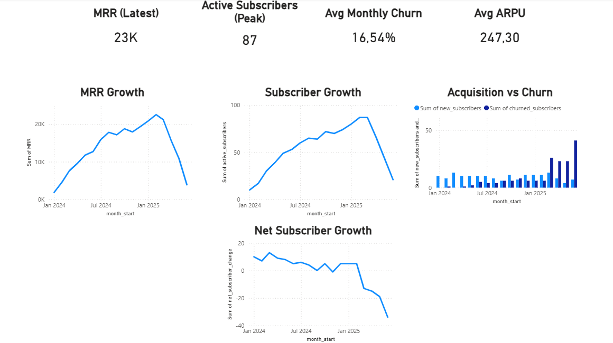
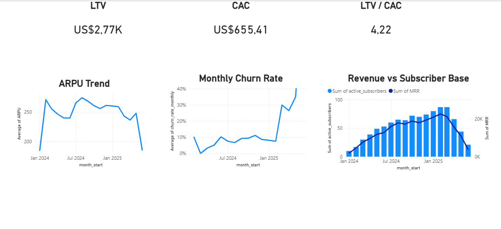
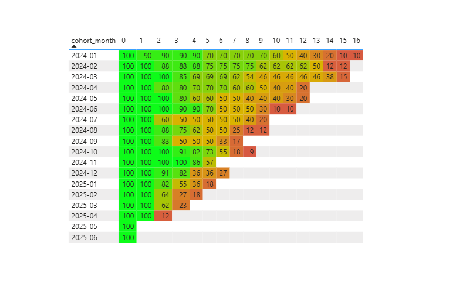

# SaaS Subscription Analytics Dashboard

This project analyzes the growth and health of a subscription-based SaaS business using Python and Power BI.

The analysis focuses on key SaaS metrics such as:

- Monthly Recurring Revenue (MRR)
- Customer churn rate
- Net subscriber growth
- Average Revenue Per User (ARPU)
- Customer Lifetime Value (LTV)
- Customer Acquisition Cost (CAC)
- Cohort retention analysis

---

# Business Problem

Subscription businesses must monitor growth, retention, and churn to maintain sustainable revenue.  
This project investigates how customer retention and churn impact subscriber growth and revenue over time.

---

# Tools Used

- Python
- Pandas
- SQL
- Power BI

---

# Key Metrics Calculated

### Growth Metrics
- Monthly Recurring Revenue (MRR)
- Active Subscribers
- Net Subscriber Growth

### Retention Metrics
- Monthly Churn Rate
- Cohort Retention

### Unit Economics
- ARPU
- LTV
- CAC
- LTV / CAC Ratio

---

# Dashboard Overview

## Growth Overview


## Unit Economics


## Cohort Retention


---

# Key Insights

- Early cohorts retain users relatively well, maintaining ~70% retention after several months.
- Later cohorts show significantly worse retention, indicating increasing churn.
- Net subscriber growth becomes negative in 2025, meaning churn exceeds new acquisition.
- Although LTV/CAC remains healthy (≈4.2), deteriorating retention threatens long-term revenue growth.

---

# Repository Structure

```
data/        → raw subscription datasets  
notebooks/   → Python analysis and metric calculations  
powerbi/     → Power BI dashboard file  
images/      → dashboard screenshots  
```

---

# Conclusion

The analysis shows that declining retention in newer customer cohorts leads to increasing churn and negative subscriber growth, ultimately impacting revenue sustainability.

Improving early user retention would be critical for stabilizing the business.
